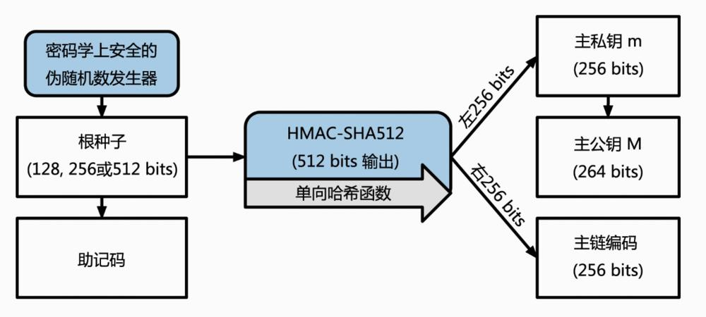
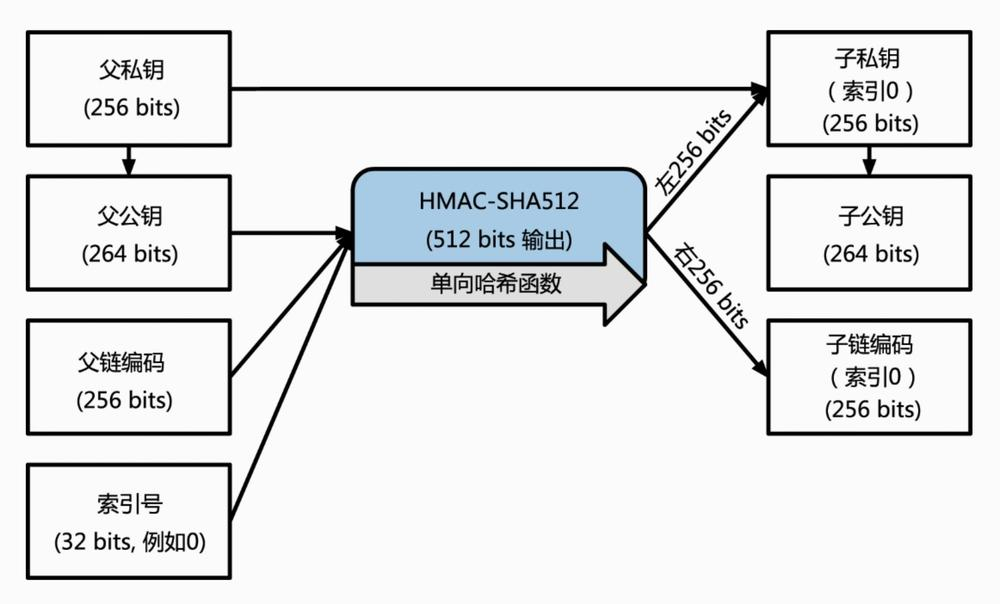

# Wallet Mnemonic PrivateKey Keystore PublicKey Address     

了解 Wallet Mnemonic PrivateKey Keystore PublicKey Address 之间的关系及转化

## Wallet  
钱包用于管理私钥，地址，助记词，广播查询交易

#### 非确定性钱包 (nondeterministic wallet)   
每个密钥都是从随机数独立生成，密钥彼此之间无关联，这种钱包也被称为“Just a Bunch Of Keys（一堆密钥）”，简称JBOK钱包

#### 确定性钱包 (hierarchical deterministic wallet) BIP-32 BIP-44  
所有密钥都是从一个主密钥派生出来，这个密钥即为种子（Seed）。该类型钱包中所有密钥都相互关联，通过原始种子可以找到所有密钥。确定性钱包中使用了很多不同的密钥推导方法，最常用的是使用树状结构，称为分级确定性钱包或者HD (hierarchical deterministic)钱包

## PrivateKey  

以太坊私钥只是一个随机数字。可以使用硬币：掷硬币256次。
私钥用于生成公钥，生成数字签名

#### 生成Privatekey  
 - 从随机数生成私钥 （crypto: randomBytes） **使用加密安全的伪随机数生成器(CSPRNG)** 
 - 私钥特点： 长度为64的16进制字符串或Buffer. **ex:0x91598453f8e6bf900fea0f8e3664d077678c8db7586bfccf92f700f60537bfe0**
 - 私钥大小： 大约 10^77，作为对比宇宙中可见原子数 10^80
 - 私钥范围： [1, n-1] (n = 1.158*10^77, 略小于 2^256)

 **私钥很重要，妥善保管**

 #### Snippet Code
 ``` js
 const privKey = randomBytes(32)
 // 91598453f8e6bf900fea0f8e3664d077678c8db7586bfccf92f700f60537bfe0
 ```

## PublicKey
以太坊的公钥是椭圆曲线上的一个点， 由私钥通过椭圆曲线加密算法生成.

 #### 生成PublicKey
 - 通过椭圆曲线函数：**secp256k1** 计算生成公钥  

 > Tip: secp256k1 椭圆曲线加密是一种基于离散对数问题的非对称或公钥加密，是单向不可逆函数   
 > 椭圆曲线库： [OpenSSL](https://www.openssl.org/) [libsecp256k1](https://github.com/bitcoin-core/secp256k1)
 
 - 以太坊使用未压缩的公钥： 前缀 0x04 ,长度 65个字节  

#### Snippet Code
```js
const pubKey = secp256k1.publicKeyCreate(privKey, false)
// 042a1313edb8eb02d0b37d60068f31d284ede4f44cfba4a3bc8a6090f751d6fbe7f7c2b5170b904b7349f473f2c7418761dbb53f87f58193840d8c916418628b90 
````

## Address  
由公钥生成的长度为20个字节的16进制数

#### 生成 Address  
由公钥通过 [Keccak-256]() 加密哈希函数计算得出， 取最后20个字节

>Tip: 
> 1. 账户类型？ 外部账户(EOA)和内部账户(合约地址)
> 2. 地址是否存储在区块链上？ 否。地址不再以太网络上传输  
> 3. 加密哈希函数的特点：确定性、可验证性、不相关性、不可逆性、碰撞保护

#### Snippet Code
``` js
const address = keccak256(pubKey.slice(1)).slice(12)
// 9a9821c49d2299e9c6597336baba3cf7b561af9d
function keccak256(...data) {
    const h = keccak('keccak256');
    data.forEach(d => {
        if (Buffer.isBuffer(d)) {
            h.update(d);
        }
        else {
            h.update(Buffer.from(d, 'utf8'));
        }
    });
    return h.digest();
}
```


## CheckSumAddress
校验和地址，用于检测正常地址中的字母输入大小写错误 [EIP-55](https://github.com/Ethereum/EIPs/blob/master/EIPS/eip-55.md)

#### Snippet Code
``` js
// 30a506566270e107da08c7ccbf621024b9917215c9ca3ce6f4c6510dc8043b89
// 9a9821c49d2299e9c6597336baba3cf7b561af9d
// 9a9821c49d2299e9C6597336BAba3cf7B561af9d
export function toChecksumAddress(address: string) {
    address = address.toLowerCase().replace('0x', '')
    let hash = createKeccakHash('keccak256').update(address).digest('hex')
    let ret = '0x'
    for (var i = 0; i < address.length; i++) {
        if (parseInt(hash[i], 16) >= 8) {
            ret += address[i].toUpperCase()
        } else {
            ret += address[i]
        }
    }
    return ret
}
```

## KeyStore   
私钥的另外一种加密方式。keystore格式使用密钥派生函数（KDF），也称为密码扩展算法，可防止针对密码加密的暴力、字典或彩虹表攻击。简单来说，私钥不直接通过密码加密。相反，通过反复对密码进行哈希运算来扩展密码。
1. 生成KeyStore [keythereum](https://github.com/ethereumjs/keythereum)
2. reference   
   - https://stevenocean.github.io/2018/04/02/about-ethereum-keystore.html  
   - https://www.jianshu.com/p/31912356451d
``` js
var options =  {
            cipher: 'aes-128-ctr',  // 对称加密算法 aes-128-cbc
            kdf: 'scrypt', // 秘钥派生函数 pbkdf2
            kdfparams: {
                dklen: 32, // 秘钥输出长度
                memory: 280000000,
                n: 262144, // 加密次数
                p: 1,
                r: 8,
            },
        }
```

## Mnemonic & Seed  
助记词是一串wordlist,方便HD钱包导出，导入. (ex. suggest road proof stone case fitness riot try lens save enrich often)  

#### mnemonic wordlist 
[wordlists](https://github.com/bitcoin/bips/tree/master/bip-0039)

#### mnemonic 生成过程
  - 1）生成长度为128-256(bits)的随机序列(熵源)，熵长度为32的正整数倍
  - 2）取熵SHA256哈希后的前n位作为校验和(n= 熵长度/32)
  - 3）随机序列(熵) + 校验和拼合为一个字符串
  - 4）把步骤3得到的结果每11位切割，得到12个字符串
  - 5）步骤4得到的每个字符串匹配预先定义的2048 个词库里的单词
  - 6）生成助记词序列
  - 
  - 

#### mnemonic => seed  
使用秘钥拉伸函数(PBKDF2)  
- `PBKDF2`基本原理是通过一个为随机函数(例如 HMAC 函数)，把助记词明文和盐值作为输入参数，然后重复进行运算最终产生生成一个更长的（512 位）密钥种子。这个种子再构建一个确定性钱包并派生出它的密钥。
- 密钥拉伸函数需要两个参数：助记词和盐。盐可以提高暴力破解的难度。 盐由常量字符串 "mnemonic" 及一个可选的密码组成，注意使用不同密码，则拉伸函数在使用同一个助记词的情况下会产生一个不同的种子


``` js
const mnemonic = bip39.generateMnemonic()
console.log('mnic: ', mnemonic) 
// nurse equip pink inside glory travel sell soup often whip stock vital

// pbkdf2(mnemonicBuffer, saltBuffer, 2048, 64, 'sha512')
const seed = bip39.mnemonicToSeed(mnemonic, '123')
console.log('seed: ', seed.toString('hex'))
// 09733578dbc90d393c24955f3b9d44f4ae27ce3f63fbe022667c90dbd25099747d78f9c03e53b727c04062dde9cdc802aa226ef91111a7b94253a301b8ef2e83
```
**通过定义助记词让种子的备份更友好**  

#### seed => privatekey  
使用分层确定性推导方案`BIP-32` 生成 n 个私钥 


> 分层推导方案： [BIP-32]()
> 路径分层推导方案： [BIP-44](https://github.com/satoshilabs/slips/blob/master/slip-0044.md)   
> 预定义树状层级结构： m / purpose' / coin_type' / account' / change / address_index  
> 例如: VET_PATH = `m/44'/818'/0'/0/0`  

#### 路径结构分析
1. m: 固定值 （主私钥衍生的私钥以`m`开头）  
2. purpose: 44  
3. coin_type: 币种类型，0 比特币正式链，1 比特币测试链， 60 以太坊， 818 Vechain
4. account : 代表这个币的账户索引，从0开始
5. change: 常量0用于外部链，常量1用于内部链（也称为更改地址）。外部链用于在钱包外可见的地址（例如，用于接收付款）。内部链用于在钱包外部不可见的地址，用于返回交易变更。 (所以一般使用0)
6. address_index: 地址索引，从0开始，代表生成第几个地址，官方建议，每个account下的address_index不要超过 `20`

#### 主私钥生成
1. 根种子输入到`HMAC-SHA512`算法中就可以得到一个可用来创造主私钥(m) 和 一个主链编码（ a master chain code)这一步生成的秘钥（由私钥或公钥）及主链编码再加上一个索引号


2. 主私钥继续衍生子私钥，子公钥，子链编码


#### 衍生推导方案  
主私钥推导（强化衍生推导），主公钥推导（常规衍生推导）。
使用**索引号（index）**区分这两个推导方案:  
常规衍生：index [0, 2^31]
强化衍生：index [2^31, 2^32 - 1]，为了方便用 i' 代表 2^31 + i

## 总结
 #### 非确定性钱包私钥流程
 

 #### 确定性钱包私钥流程
 
    

## Tip
1. [BIP-39](https://github.com/bitcoinjs/bip39#readme) : 助记词单词表

2. [BIP-32](https://github.com/bitcoin/bips/blob/master/bip-0032.mediawiki) : 私钥的分层推导方案

3. [BIP-44](https://github.com/satoshilabs/slips/blob/master/slip-0044.md) : 对 bip-32 增加了路径定义规范 
